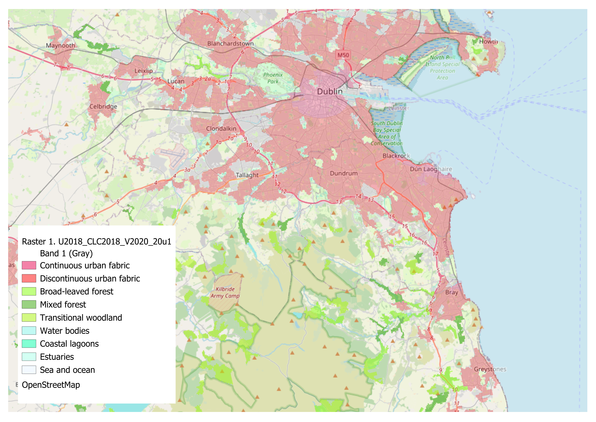

# Eco Levels Ireland: Ecoscape Ireland Repository

## Overview
Welcome to the **Ecoscape Ireland** repository, the core of Eco Levels Ireland’s mission to provide data-driven environmental insights for Ireland. We specialize in spatial analysis and visualization of environmental datasets, focusing on tree coverage, biodiversity, and urban green spaces. Using tools like **QGIS**, we create actionable maps and reports to support NGOs, local councils, and community groups in Ireland with sustainable decision-making.

Eco Levels Ireland is a side venture passionate about leveraging open data to promote environmental sustainability, particularly through tree-related initiatives. This repository houses our projects, datasets, and QGIS workflows for mapping and analyzing Ireland’s ecological landscape.

## About Eco Levels Ireland
Eco Levels Ireland is founded by a data professional with expertise in datasets and databases, particularly address-related data. Inspired by a personal interest in trees and environmental sustainability, we aim to bridge data science and ecology to deliver valuable insights to stakeholders in Ireland.

## Repository Purpose
The **Ecoscape Ireland** repository contains:
- **QGIS Projects**: Mapping layers visualizing environmental data, such as tree coverage, land use, and green spaces across Ireland.
- **Datasets**: Sourced from open platforms like [data.gov.ie](https://data.gov.ie) and other public environmental datasets (e.g., Tailte Éireann for land and property data).
- **Scripts and Tools**: Python or other scripts for processing and analyzing spatial data, compatible with QGIS.
- **Reports**: Summaries and visualizations tailored for NGOs and local councils to support environmental planning and policy.

## Current Projects

# Eco Levels Ireland: Ecoscape Ireland Repository

## Current Projects

- **Wicklow Urban Populations & Forest Types (2022/2018)**:
  [.png)](Wicklow%20Urban%20Populations%20&%20Forest%20Types%20(2022_2018).png)
  33 Wicklow towns with 2022 Census populations (e.g., Greystones: 22,009), Wicklow county highlighted, and CORINE 2018 forests in 4 green classes (Broad-Leaved, Coniferous, Mixed, Transitional). White halo labels for clarity. Council-ready!

- **Dublin Tree Cover Mapping (2018)**:
  
  Tree cover map of Dublin using CORINE Land Cover 2018, highlighting forest classes by Local Electoral Areas.
  
## Data Sources
- **data.gov.ie**: Open datasets on land use, environmental features, and more.
- **Tailte Éireann**: Property and land data for Ireland.
- Other public APIs and environmental datasets (to be expanded).

## Future Goals
- Expand dataset integration to include real-time environmental data.
- Develop automated QGIS workflows for scalable map production.
- Partner with Irish NGOs and councils to deliver high-impact environmental reports.

## Ready for Your County?
Want this map for **Cork, Galway, or all Ireland**?  
- €200 per county  
- Tree cover % per town included  
- Interactive web version available  

## Contact

Email: ecolevelsireland@gmail.com

For inquiries, custom projects, or to discuss how Eco Levels Ireland can support your organization, email us at ecolevelsireland@gmail.com.

Follow our progress on GitHub or connect with us for updates on tree-focused environmental initiatives in Ireland!

